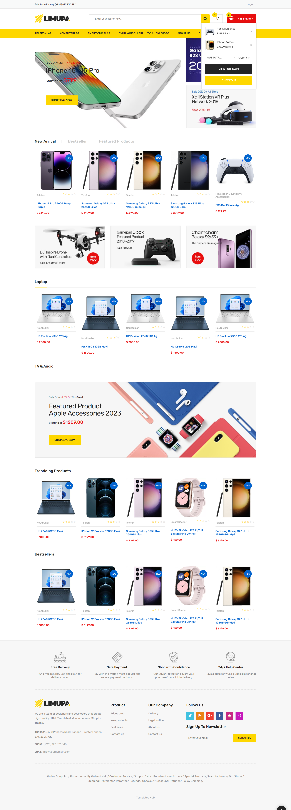
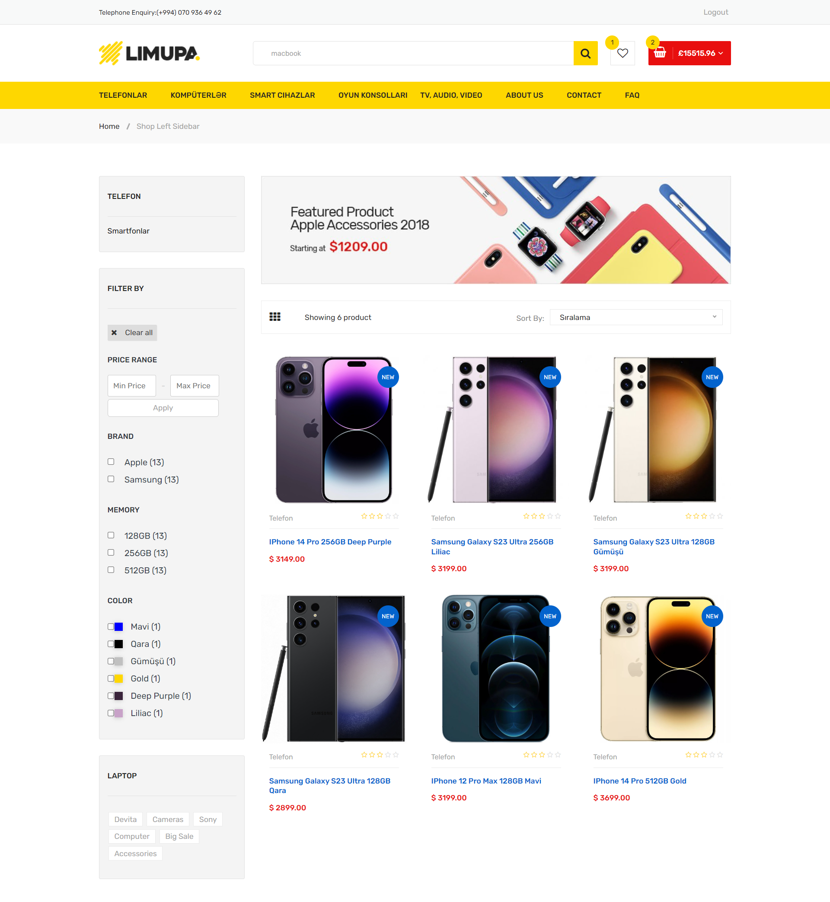

# Limupa E-commerce website
Limupa is a powerful e-commerce platform built on Django, designed to streamline the online shopping experience for technology enthusiasts. It provides robust features for managing and selling tech products, including advanced cart management, user authentication, and secure payment processing.

# To Do List
- Sign up, Sign in and Logout your account
* Login with facebook or gmail
+ Look at the products page
- Search products
* Look at the product itself
+ Give rates and comments
- Filter products for colors, sizes, brands and categories
+ Change password
- Adding, deleting products to your basket and wishlist
* Buying the products in your basket
* Paying with PayPal

# What I Learned
- Used Django to create e-commerce website
+ Create Periodic tasks using Celery and redis
- Created Authentication and Authorization system
+ Jinja & combination frontend and backend
- Search functionality
+ Writing and Deleting Comments functionality
- Writing advanced filtering system for filter products
- Working with django ORM and Forms
+ Worked with ajax to add, delete products to(from) basket without refreshing page
- Used postgresql database to stores all data
+ Used social auth to code social login system

# Limupa E-commerce website

# Search Page

